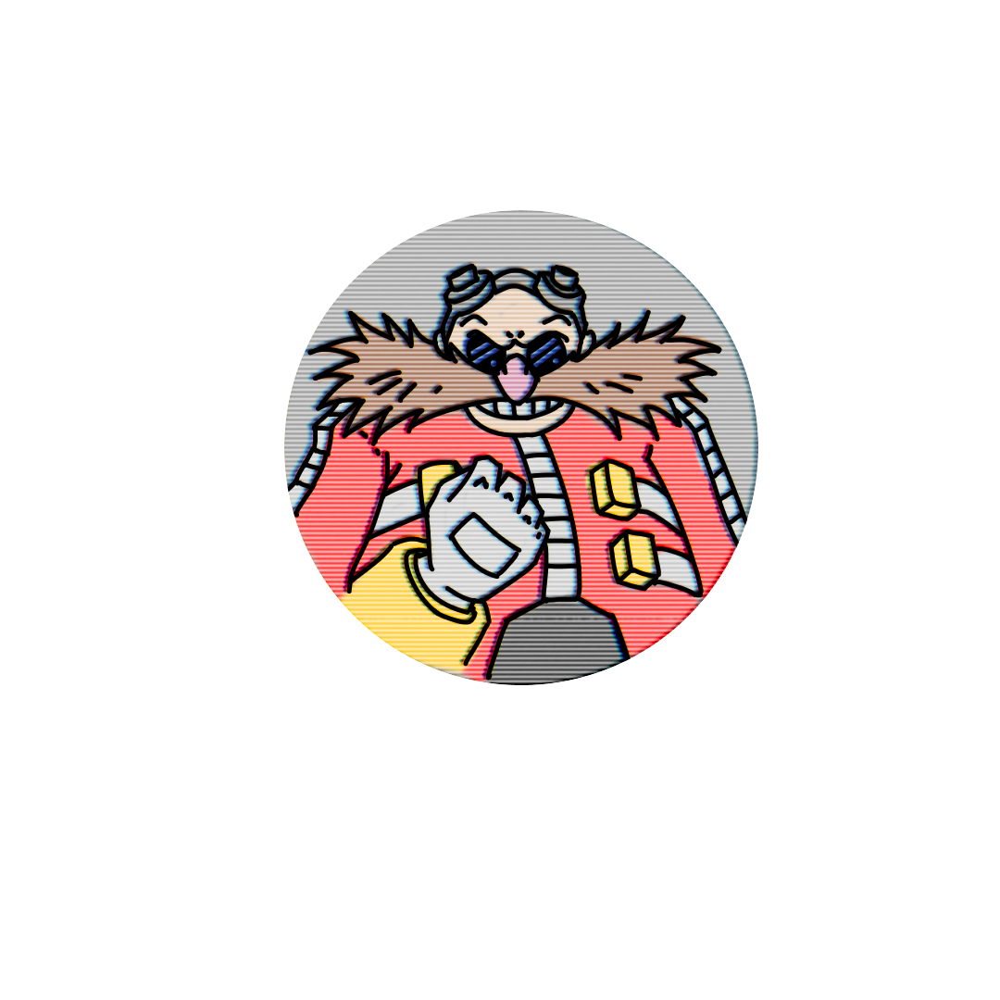
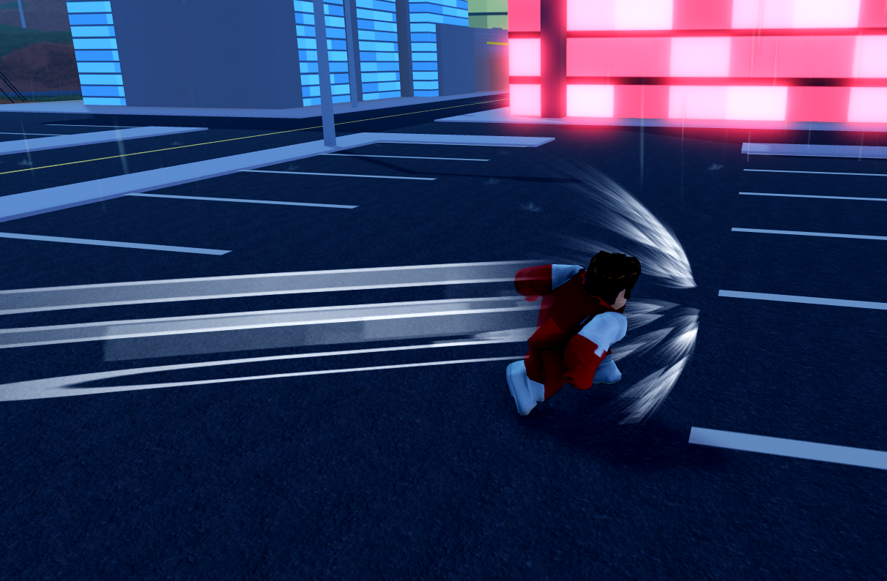

<p align="center">
  
</p>
<h2 align="centre">
   Dr. Rosploitnik </h2>
  An all purpose Roblox client-sided script that will meet all your Ro-sploiting needs. - Dr. Rosploitnik (2026)
</h2>

## Contacts
[Discord Server](https://discord.gg/ACQGysdVkd)
<br/>
[Dr Rosploitnik Youtube](https://www.youtube.com/@DrRosploitnik-k)
<br/>
[JonTurtleTaub Youtube](https://www.youtube.com/@JONTURTLETAUB)

## How to Use
1. Download the "specific scripting application" of your choice.
2. Execute the loadstring that is provided down below.
```luau
loadstring(game:HttpGet("https://raw.githubusercontent.com/desognedbyjonturtletaub/Dr.-Rosploitnik/v0.0.8/Main.lua", true))()
````
## Developers & Credits
[``Desognedby``](https://github.com/desognedbyjonturtletaub)   - Joint Account
<br/>
[``lelogint``](https://github.com/lelogint)   -Programmer, Ui Designer
<br/>
[``Eclipse<h2``](https://github.com/Eclipse-h2)   -Sound Provider Of Project, Ui Designer
<br>
<h2>Previews:</h2>

<table border="0">
  <!-- TOP ROW -->
  <tr>
    <td></td>
  </tr>
  <!-- BOTTOM ROW -->
  <tr>
    <td></td>
  </tr>
</table>
